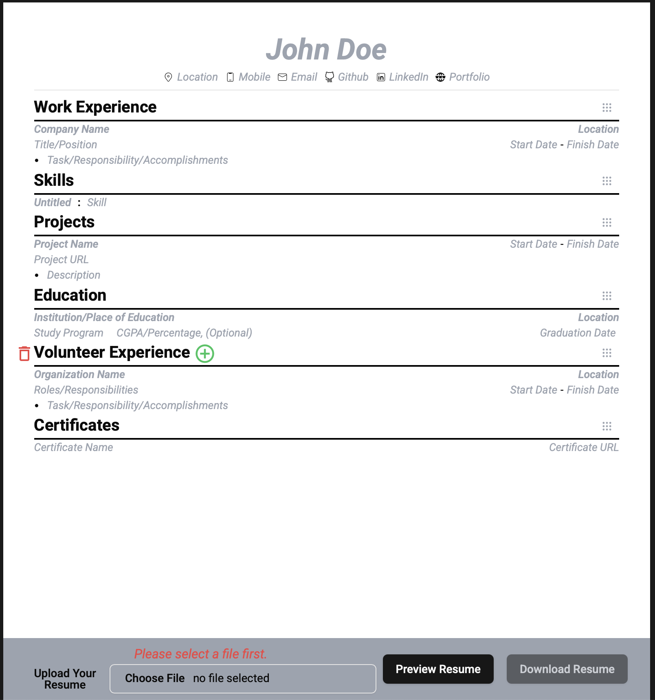

# 🧾 Resume Builder - TypeScript + React

A clean, customizable, developer-first resume builder powered by **React**, **TypeScript**, and **Vite**. Perfect for engineers who want full control over resume layout and content — all locally, with no external dependencies.



---

## 🚀 Features

- ⚛️ Built with React + TypeScript
- ⚡ Superfast dev server via Vite
- ✍️ Structured, editable data in JSON/TS
- 💾 Easily downloadable in PDF
- 🎨 Custom styling via CSS or Tailwind
- 🧩 Clean, modular, and extensible structure

---

## 🌐 Live Demo

👉 [https://resume.neelmani.in](https://resume.neelmani.in)

---

## 📦 Installation

```bash
git clone https://github.com/neelmanisingh25/resume-tsc.git
cd resume-tsc
pnpm install
pnpm run dev
```
## ✏️ Customization Guide

The default data lives in src/constants/defaultResume.ts, change the resume data there with yours for a static site
Styling has been done with Tailwind CSS, feel free to play around it and give birth to a new template.

## 🧪 Roadmap Ideas

- Multiple resume templates
- JSON resume import/export
- Offline mode with PWA support
- AI support increased to re-writing resume and ATS score
- Cover letter generation based on Resume

## 🤝 Contributing

Want to make it better? Feel free to fork, raise issues, or submit a PR 🙌
Open to ideas, templates, or even complete redesigns.

## 📄 License

MIT License © Neelmani Singh

## 💼 Connect with Me

LinkedIn: https://linkedin.com/in/neelmani-singh98
